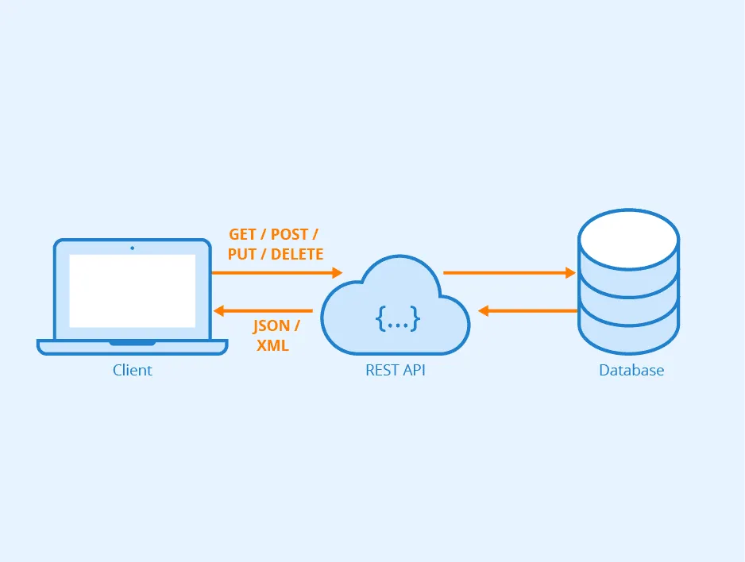

# Django REST Framework - Part 1

## RESTful API คืออะไร

[Source:](https://aws.amazon.com/th/what-is/restful-api/)

RESTful API เป็นอินเทอร์เฟซที่ระบบคอมพิวเตอร์สองระบบใช้เพื่อแลกเปลี่ยนข้อมูลผ่านอินเทอร์เน็ตได้อย่างปลอดภัย แอปพลิเคชันทางธุรกิจส่วนใหญ่ต้องสื่อสารกับแอปพลิเคชันภายในอื่นๆ และของบุคคลที่สามเพื่อทำงานต่างๆ ตัวอย่างเช่น หากต้องการสร้างสลิปเงินเดือน ระบบบัญชีภายในของคุณต้องแบ่งปันข้อมูลกับระบบธนาคารของลูกค้าเพื่อออกใบแจ้งหนี้และสื่อสารกับแอปพลิเคชันบันทึกเวลาปฏิบัติงานภายในโดยอัตโนมัติ RESTful API ให้การสนับสนุนการแลกเปลี่ยนข้อมูลนี้เพราะเป็นระบบที่มีมาตรฐานการสื่อสารระหว่างซอฟต์แวร์ที่ปลอดภัย เสถียร และมีประสิทธิภาพ

## API คืออะไร

ส่วนต่อประสานโปรแกรมประยุกต์ **(Application Programming Interface หรือ API)** กำหนดกฎที่คุณต้องปฏิบัติตามเพื่อสื่อสารกับระบบซอฟต์แวร์อื่น โดยนักพัฒนาเปิดเผยหรือสร้าง API เพื่อให้แอปพลิเคชันอื่นสามารถสื่อสารกับแอปพลิเคชันของตนได้ทางโปรแกรม ตัวอย่างเช่น แอปพลิเคชันบันทึกเวลาปฏิบัติงานแสดง API ที่ขอชื่อเต็มของพนักงานและช่วงวันที่ เมื่อได้รับข้อมูลนี้แล้ว ระบบจะประมวลผลบันทึกเวลาปฏิบัติงานของพนักงานเป็นการภายใน และส่งกลับจำนวนชั่วโมงที่ทำงานในช่วงวันที่ดังกล่าว

ทั้งนี้คุณสามารถมองได้ว่า API เว็บเป็นเกตเวย์ระหว่าง `client` และ `resource` บนเว็บ

`Client`
ไคลเอ็นต์คือผู้ใช้ที่ต้องการเข้าถึงข้อมูลจากเว็บ โดยไคลเอ็นต์อาจเป็นบุคคลหรือระบบซอฟต์แวร์ที่ใช้ API ก็ได้ ตัวอย่างเช่น นักพัฒนาสามารถเขียนโปรแกรมที่เข้าถึงข้อมูลสภาพอากาศจากระบบสภาพอากาศ หรือคุณสามารถเข้าถึงข้อมูลเดียวกันจากเบราว์เซอร์เมื่อคุณเยี่ยมชมเว็บไซต์รายงานสภาพอากาศได้โดยตรง

`Resource`
ทรัพยากรคือข้อมูลที่แอปพลิเคชันต่างๆ มอบให้แก่ไคลเอ็นต์ โดยทรัพยากรอาจเป็นรูปภาพ วิดีโอ ข้อความ ตัวเลข หรือข้อมูลประเภทใดก็ได้ ทั้งนี้เครื่องคอมพิวเตอร์ที่มอบทรัพยากรให้แก่ไคลเอ็นต์นั้นเรียกอีกอย่างว่าเซิร์ฟเวอร์ องค์กรต่างๆ ใช้ API เพื่อแบ่งปันทรัพยากรและให้บริการเว็บในขณะที่ยังคงดูแลรักษาความปลอดภัย การควบคุม และการรับรองความถูกต้องไปพร้อมกัน นอกจากนี้ API ยังช่วยให้ลูกค้าระบุได้ว่าไคลเอ็นต์ใดสามารถเข้าถึงทรัพยากรภายในที่เฉพาะเจาะจงได้


การใช้งานจะแบ่งออกเป็น 3 รูปแบบ

- Private API หมายถึง API ที่ใช้งานเพื่อเชื่อมต่อกันระหว่างแอพพลิเคชั่นภายในองค์กรเท่านั้น ไม่สามารถเรียกใช้งานภายนอกองค์กรได้
- Partner API หมายถึง API ที่เปิดให้ใช้งานเฉพาะ Partner หรือ คู่ค้าทางธุรกิจ ซึ่งจะจำกัดช่องทางในการเชื่อมต่อ API ไว้และเปิดให้ใช้งานเฉพาะ Partner ที่ทำข้อตกลงการใช้บริการเท่านั้น
- Public API หมายถึง API ที่เปิดให้บริการแบบสาธารณะ ซึ่งจะเปิดให้ผู้พัฒนาแอพพลิเคชั่นอื่นๆ สามารถใช้งานได้เลย โดยส่วนใหญ่จะเป็น API ที่สามารถเรียกใช้งานได้ฟรีหรือเรียกใช้งานได้จำกัดจำนวน ซึ่งถ้าหากต้องการเรียกใช้งานแบบไม่จำกัดจำนวนอาจจะมีการคิดค่าบริการหรือทำข้อตกลงการใช้งานในรูปแบบ Partner API แทน

## REST API คืออะไร

Representational State Transfer (REST) API คือการสร้าง API ประเภท RESTful web services ซึ่งจัดเป็น Web Service รูปแบบหนึ่งที่ทำงานอยู่บนพื้นฐานของโปรโตคอล HTTP และ HTTPS ประกอบด้วย Request และ Response ตามรูปแบบของ HTTP ที่รับส่งข้อมูลหรือเนื้อหาในรูปแบบของ XML , SOAP , JSON



## การออกแบบ RESTful API

[Source](https://medium.com/@jerapabeamgosoonsongthanee/%E0%B8%AD%E0%B8%AD%E0%B8%81%E0%B9%81%E0%B8%9A%E0%B8%9A-restful-api-%E0%B8%A2%E0%B8%B1%E0%B8%87%E0%B9%84%E0%B8%87%E0%B9%83%E0%B8%AB%E0%B9%89%E0%B8%9B%E0%B8%B1%E0%B8%87-69d2015bcc31)

การออกแบบ restful API ที่ดีสิ่งที่ต้องคำนึกถึงก็คือ

### 1. เลือกใช้ HTTP Method ให้เหมาะสมกับการใช้งาน

ปกติในการสร้าง URL เราจะไม่ใช้ verb ของ API นั้นมาอยู่ใน path เช่น /createUsers, /getUserDetail ... อ้าว แล้วเราจะรู้ได้อย่างไรล่ะ ว่าแต่ละ API จะมี action อะไร??? เลยกำเนิดสิ่งนี้ขึ้นมานั่นคือ HTTP Method นั่นเองค่าา โดย HTTP Method ที่สำคัญมีดังนี้

1. POST เป็น method สำหรับสร้างข้อมูลใหม่ โดยจะส่งข้อมูลในการสร้างผ่านทาง body เช่นแทนที่จะเขียนว่า /createUsers ก็เขียนเป็น /users ที่มี method POST แทน
2. PUT เป็น method สำหรับแก้ไขข้อมูลที่มีอยู่แล้วในระบบ (ทั้ง object)หรือถ้าไม่มีในระบบจะสร้างข้อมูลใหม่
3. PATCH เป็น method สำหรับแก้ไขข้อมูลที่มีอยู่แล้วในระบบ คล้ายกับ PUT แต่ PATCH ใช้กรณีอัพเดทแค่ไม่กี่ค่า
4. GET เป็น method สำหรับเรียกข้อมูล และจะไม่มีผลกระทบอะไรกับข้อมูลในระบบ
5. DELETE เป็น method สำหรับลบข้อมูลที่มีอยู่ในระบบ

สรุป HTTP Method เป็นตัวสื่อถึง action ของ API นั้นๆ โดยที่เราไม่จำเป็นต้องใส่ action จริงๆ เข้าไปใน path

### 2. การสร้าง URL ของ API endpoint ให้ตรงตามมาตรฐาน

ในการสร้าง URL ของ API นั้นมีทั้งหมดสามกฎที่สำคัญ ก็คือ

1. ควรจะมีแค่ resource เท่านั้น(resource เป็นตัวแทนของ สิ่งของบางอย่าง ที่เชื่อมโยงกับข้อมูล เช่น Users, Customers, Orders)
2. ชื่อ path ควรจะเป็นรูปพหูพจน์ของ resource
3. ไม่ควรจะมี action ที่บอกถึงวัตถุประสงค์ของ API (เช่น add, update, delete) ตามที่กล่าวในข้อแรก

สมมติว่าต้องการ API ที่เกี่ยวข้องกับ Users โดยการสามารถ สร้างข้อมูล user, แก้ไขข้อมูล user, แสดงข้อมูล user และ ลบข้อมูล user เราสามารถเขียนออกมาได้ดังนี้

- method: POST path: /users สร้างข้อมูล user ใหม่
- method: PUT path: /users/99 จะแก้ไขข้อมูล user ที่ id 99
- method: GET path: /users จะได้ข้อมูลของ user ทั้งหมด
- method: GET path: /users/99 จะได้รายละเอียดของ user ที่ id 99
- method: DELETE path: /users/99 จะเป็นการลบข้อมูล user ที่ id 99

### 3. ใช้ HTTP Status code ให้ตรงตามความหมาย

หลังจากที่ฝั่งผู้ใช้งาน API (client) ส่ง request ไปหา server ผ่าน API แล้วนั้น ฝั่ง client จะรู้ได้อย่างไรว่า API นี้ ตกลงใช้งานได้จริงหรือเปล่า หรือส่งไปสำเร็จไหม เราจึงต้องส่ง response ที่มี HTTP Status code ระบุ กลับไปยัง client เพื่อบอกว่า request นั้นๆ Pass, Fail หรือ request นั้นผิด

กรณี Success จะมี HTTP status code ที่ใช้งานกันทั่วไปได้แก่

- **200 Ok:** เป็นมาตรฐานของ HTTP response เพื่อบ่งบอกว่า request นั้น Success ใช้สำหรับ GET, PUT หรือ POST ก็ได้เช่นกัน
- **201 Created:** เป็น response เพื่อบ่งบอกว่าข้อมูลใหม่ได้ถูกสร้างขึ้นสำเร็จ ใช้สำหรับ POST
- **204 No Content:** เป็น response สำหรับบ่งบอกดำเนินการ Success แต่ไม่ได้ return ข้อมูลกลับ ส่วนใหญ่จะใช้กรณีลบข้อมูล DELETE ที่ไม่ได้ส่ง response ที่เป็นข้อมูลกลับไป

กรณี Error จะมี HTTP status code ที่ใช้งานกันทั่วไปได้แก่

- **400 Bad Request:** เป็น general error ก็ว่าได้ status นี้จะบ่งบอกว่า request ที่ส่งมาโดย client นั้นไม่มี action ใดๆ และ Server ไม่เข้าใจ เช่น JSON ผิด หรือ parameters ไม่ถูกต้อง
- **401 Unauthorized:** เป็น response ที่บ่งบอกว่า client ไม่ได้รับอนุญาตในการเข้าถึง อาจจะเป็นกรณีที่ใส่ token ผิด หมดอายุ หรือไม่ได้แนบ token มา
- **403 Forbidden:** เป็น response ที่บ่งบอกว่า client ได้รับการอนุญาตในการเข้าถึงระบบ (login ผ่าน)แต่จะมีข้อมูลบางหน้า ที่ไม่มีสิทธิ์ในการเข้าถึง
- **404 Not Found:** เป็น response ที่บ่งบอกว่า request นั้นไม่ว่างใช้งานตอนนี้ หรือ request ที่เรียกนั้นไม่มีอยู่ในระบบ
- **405 Gone:** เป็น response ที่บ่งบอกว่า resource ที่ต้องการนั้นไม่มี หรือถูกย้ายไป
- **429 Too many Request:** เป็น response ที่บ่งบอกว่า request นั้นติด limit ใช้กรณีที่เรากำหนด rate limit ไว้ว่า API นั้นๆจะสามารถเรียกได้กี่ครั้ง
- **500 Internal Server Error:** เป็น response ที่บ่งบอกว่าการ request นั้นถูกต้องแล้ว แต่ server พังเอง ซึ่งอาจจะพังที่ตัวโค้ดของระบบเอง
- **503 Service Unavailable:** เป็น response ที่บ่งบอกว่า server ใช้การไม่ได้ (ระบบพังนั่นเอง) โดย Server จะไม่สามารถรับ request ที่ส่งเข้ามาได้
- **504 Bad Gateway Gateway Timeout:** เป็น response ที่บ่งบอกว่า web server อย่างพวก nginx หรือ apache พังนั้นเอง

### 4. การ Handle Error ให้ user เข้าใจ

นอกเหนือจาก HTTP Status code แล้ว เราต้องออกแบบ response สำหรับ error กรณีต่างๆ ไว้ด้วย เพื่อให้ user เข้าใจ error ของ API มากขึ้น ยกตัวอย่างกรณีที่ request ส่งบาง parameter มาไม่ถูกต้อง แทนที่จะ response กลับไปว่า

```javascript
{
   "statusCode": 400,
   {
    "message": "Invalid",
    "errors": [
            { 
                "field": "phone",
                "detail": "phone is invalid format."
            },
            { 
                "field": "email",
                "detail": "email is invalid format."
            },
        ]
    }
}
```
